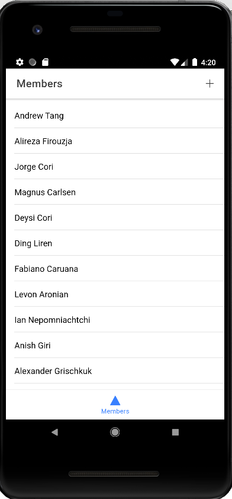
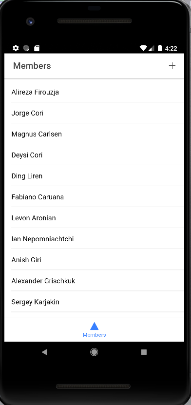
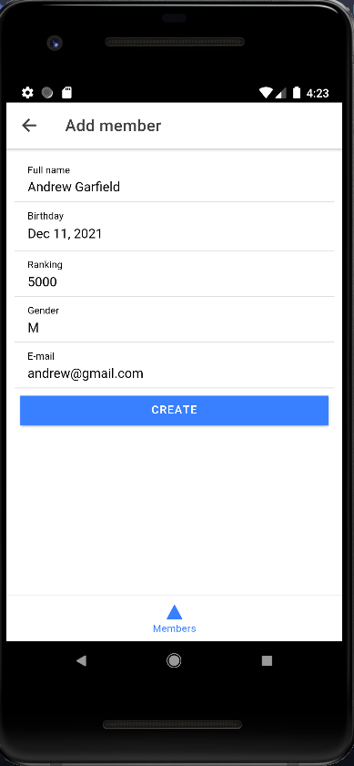
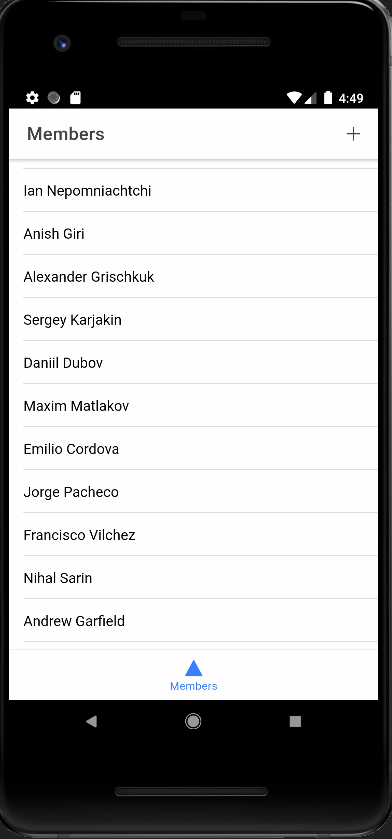
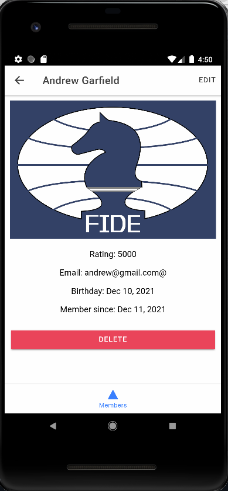
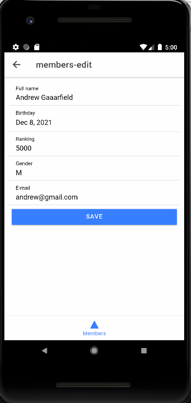
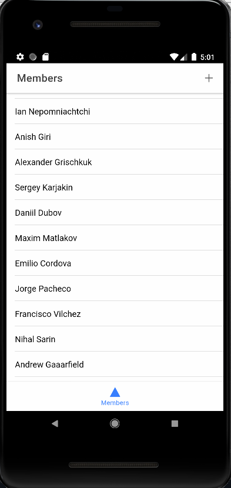
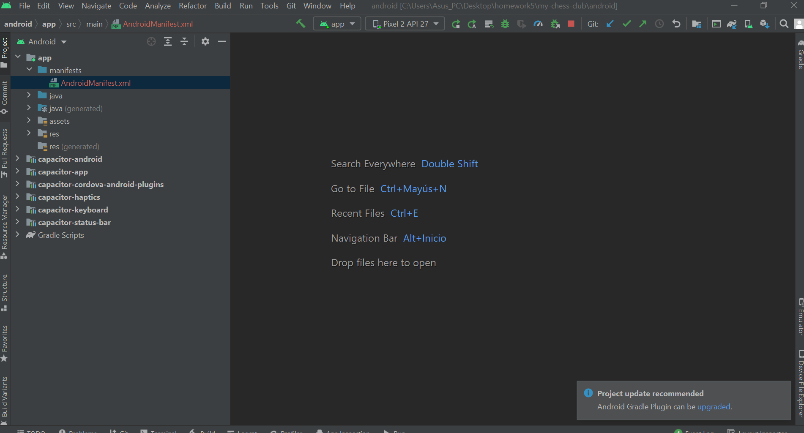

# ss_hw5
- ``list.png``

- ``view.png``

- ``delete.png``

- ``list_delete.png``

- ``create.png``

- ``list_create.png``

- ``view_create.png``

- ``edit.png``

- ``view_edit.png``

- ``ide.png``

